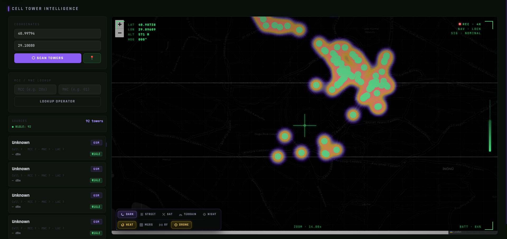
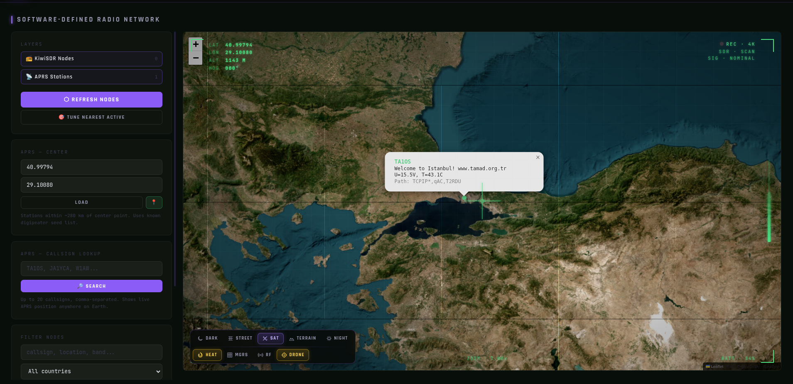
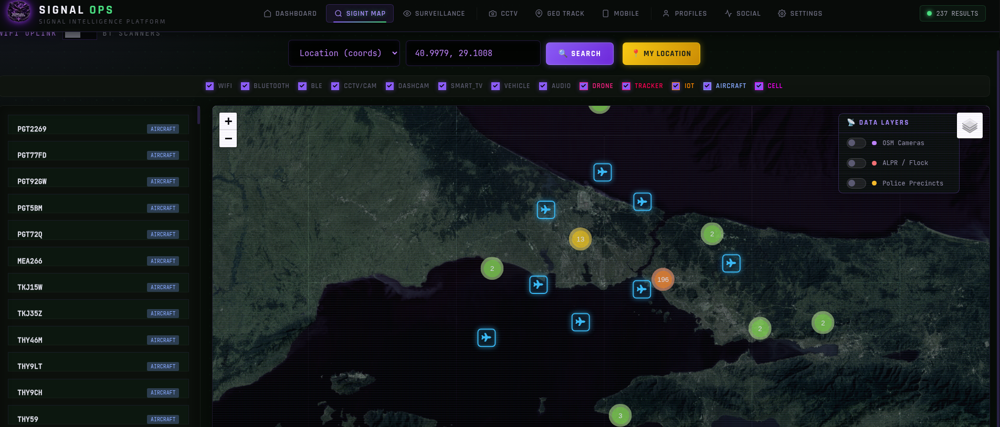
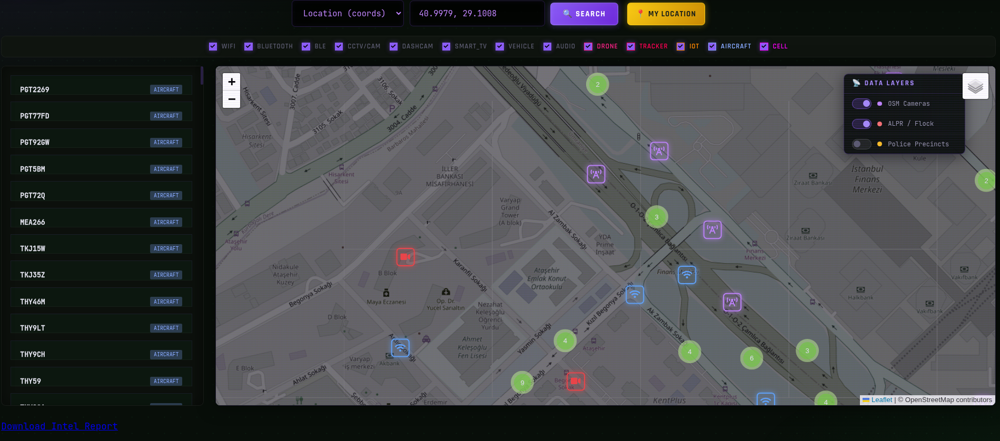
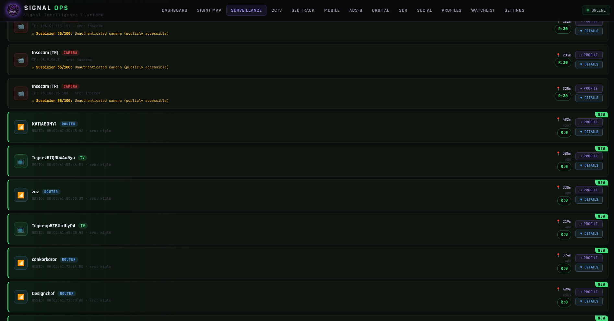
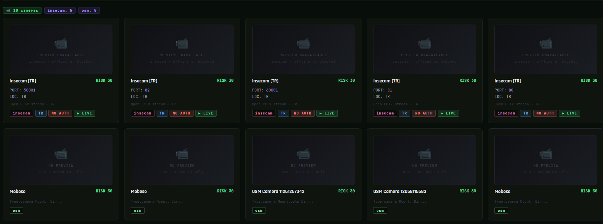

# Signal OPS — HawkOsint

A signals-intelligence and OSINT aggregation dashboard for **security research and educational purposes**. Signal OPS unifies dozens of public data sources — WiFi/Bluetooth/cell-tower databases, internet-exposure scanners, camera indexes, ADS-B flight feeds, satellite TLE tracking, and SDR/APRS networks — behind a single Flask API and map interface, with optional AI-assisted threat summaries.

> ⚠️ **Legal & ethical notice**
> This tool is intended strictly for authorized security research, education, and analysis of data that is already publicly available through third-party APIs. You are responsible for complying with the terms of service of every API you enable, and with all applicable laws in your jurisdiction. Do **not** use it to access systems you don't own or aren't authorized to test, to surveil individuals, or for any unlawful purpose. The authors provide this software "as is," without warranty, and accept no liability for misuse.

---

## Features

- **Unified RF/OSINT scan** — one call fans out to WiFi, Bluetooth, cell-tower, IoT, camera, and aircraft sources in parallel, deduplicates, and scores results.
- **Camera discovery** — Shodan, FOFA, BinaryEdge, Windy Webcams, OpenStreetMap surveillance nodes, and Insecam, by coordinates or by country.
- **Cellular intelligence** — cell-tower lookups (WiGLE, OpenCellID) with offline MCC/MNC → operator/country resolution and IMSI-catcher / Stingray heuristics.
- **Wireless threat detection** — rogue / evil-twin access point detection and Bluetooth tracker (AirTag, Tile, SmartTag…) identification.
- **Airspace monitoring** — live ADS-B via adsb.fi and OpenSky, emergency-squawk decoding, drone heuristics, and a GPS-jamming heatmap derived from aircraft NAC-P.
- **Orbital tracking** — CelesTrak TLE ingestion with SGP4 propagation, mission classification, and SatNOGS ground-station overlay.
- **SDR & APRS** — public KiwiSDR receiver map and APRS.fi station lookups.
- **IP threat intelligence** — multi-source aggregation (ipinfo, AbuseIPDB, CriminalIP, LeakIX, ZoomEye) with a lightweight port scan and combined risk scoring.
- **Watchlist & alerts** — track specific BSSIDs, SSIDs, IPs, MACs, or ICAO hexes and get hits during scans.
- **AI analysis (optional)** — Google Gemini summarizes scan results into assessments and risk levels when a key is provided.

Almost every source is **optional**. If a key isn't set, that fetcher is skipped gracefully — the free sources (OpenStreetMap, Insecam, ipinfo.io, ADS-B, CelesTrak, KiwiSDR) work with no keys at all.

---

## Screenshots

### SIGINT Map — unified multi-source view

The main map fuses WiFi, Bluetooth, cell, camera, and aircraft layers over the same area, with toggleable overlays for OSM cameras, ALPR/Flock networks, and police precincts.





### Surveillance & CCTV

| Surveillance feed | CCTV discovery |
|---|---|
|  |  |

The surveillance list scores each device (e.g. *"Suspicion 35/100: Unauthenticated camera"*) and merges routers, TVs, and exposed cameras from WiGLE, Insecam, and OSM. The CCTV view groups discovered cameras by source with per-camera risk and live/metadata status.

### Cell Tower Intelligence & SDR / APRS

| Cell tower heatmap | SDR / APRS network |
|---|---|
|  |  |

Cell-tower intelligence plots tower density with MCC/MNC operator lookup; the SDR view maps public KiwiSDR receivers and APRS stations with callsign lookup.

> Screenshots live in the `screenshots/` folder. Replace or add images there and update the paths above to match.

---

## Requirements

- Python 3.9+
- The Python packages listed below

Core dependencies:

```
flask
requests
python-dotenv
```

Recommended (enables full functionality — caching, rate limiting, satellite propagation):

```
cachetools        # bounded geo-cache (falls back to an unbounded dict if missing)
flask-limiter     # request rate limiting
sgp4              # satellite position propagation for /api/satellites
google-genai      # Gemini AI analysis (only if you use GEMINI_API_KEY)
```

Install everything:

```bash
pip install flask requests python-dotenv cachetools flask-limiter sgp4 google-genai
```

---

## Setup

### 1. Clone and enter the project

```bash
git clone https://github.com/<your-username>/<your-repo>.git
cd <your-repo>
```

### 2. (Optional) create a virtual environment

```bash
python -m venv venv
source venv/bin/activate      # Windows: venv\Scripts\activate
```

### 3. Install dependencies

```bash
pip install -r requirements.txt
```

If you don't have a `requirements.txt`, use the `pip install` line from the Requirements section above.

### 4. Configure your environment

Copy the example file and fill in the keys you have:

```bash
cp .env.example .env
```

Then open `.env` and paste in your API keys. **Every key is optional** — leave any line blank (or delete it) to disable that source. See the next section for what each one does and where to get it.

### 5. (Optional) add local datasets

For instant, offline camera and precinct lookups, place these under a `data/` directory (or point `DATA_DIR` elsewhere):

```
data/CAMERAS_WITH_NETWORK_DATA.geojson   # Point features (cameras)
data/police_precincts_usa.geojson        # Polygon features (US precincts)
data/camera_networks.json                # network-sharing metadata
data/tiles/{z}/{x}/{y}.json              # optional tiled camera dataset
```

If these files are absent, the app automatically falls back to live OpenStreetMap Overpass queries.

### 6. Run

```bash
python app_v2.py
```

The server starts on **http://0.0.0.0:8080**. Open `http://localhost:8080` in your browser.

Check which providers loaded successfully at any time:

```
GET /api/status     # active vs. missing keys
GET /api/debug      # per-key boolean + live WiGLE auth test
```

---

## Environment variables

Create a `.env` file in the project root. Below is the full list read by the app.

### Data-source API keys (all optional)

| Variable | Provider | Get a key at |
|---|---|---|
| `WIGLE_API_NAME` | WiGLE (WiFi/BT/cell) — username | https://wigle.net/account |
| `WIGLE_API_TOKEN` | WiGLE — API token | https://wigle.net/account |
| `OPENCELLID_API_KEY` | OpenCellID (cell towers) | https://opencellid.org |
| `SHODAN_API_KEY` | Shodan (exposure / cameras) | https://account.shodan.io |
| `CENSYS_API_ID` | Censys — API ID | https://search.censys.io/account/api |
| `CENSYS_API_SECRET` | Censys — API secret | https://search.censys.io/account/api |
| `ZOOMEYE_API_KEY` | ZoomEye | https://www.zoomeye.org/profile |
| `FOFA_EMAIL` | FOFA — account email | https://fofa.info |
| `FOFA_API_KEY` | FOFA — API key | https://fofa.info |
| `HUNTERHOW_API_KEY` | Hunter.how | https://hunter.how |
| `NETLAS_API_KEY` | Netlas | https://netlas.io |
| `LEAKIX_API_KEY` | LeakIX | https://leakix.net |
| `CRIMINALIP_API_KEY` | CriminalIP | https://www.criminalip.io |
| `BINARYEDGE_API_KEY` | BinaryEdge | https://www.binaryedge.io |
| `WINDY_API_KEY` | Windy Webcams | https://api.windy.com/keys |
| `ABUSEIPDB_API_KEY` | AbuseIPDB (IP reputation) | https://www.abuseipdb.com/account/api |
| `ADSB_API_KEY` | adsb.fi (optional; works without) | https://adsb.fi |
| `APRS_FI_KEY` | APRS.fi (ham radio stations) | https://aprs.fi/page/api_key |
| `GEMINI_API_KEY` | Google Gemini (AI analysis) | https://aistudio.google.com/apikey |

### App configuration

| Variable | Default | Description |
|---|---|---|
| `GEMINI_MODEL` | `gemini-2.0-flash` | Gemini model used for analysis |
| `DATA_DIR` | `./data` | Directory for local GeoJSON/JSON datasets |
| `FLASK_SECRET_KEY` | random per run | Flask session secret; set a fixed value in production |

### No-key sources (always on)

These need no configuration: **OpenStreetMap Overpass**, **Insecam**, **EarthCam**, **ipinfo.io**, **ADS-B (adsb.fi / OpenSky)**, **CelesTrak TLE**, **SatNOGS**, and **KiwiSDR**.

---

## `.env.example`

Save this as `.env.example` in your repo so others know the format:

```env
# ── Signal OPS environment ──
# Every key is optional. Leave blank to disable that source.

# WiFi / Bluetooth / Cell
WIGLE_API_NAME=
WIGLE_API_TOKEN=
OPENCELLID_API_KEY=

# Internet-exposure scanners
SHODAN_API_KEY=
CENSYS_API_ID=
CENSYS_API_SECRET=
ZOOMEYE_API_KEY=
FOFA_EMAIL=
FOFA_API_KEY=
HUNTERHOW_API_KEY=
NETLAS_API_KEY=
LEAKIX_API_KEY=
CRIMINALIP_API_KEY=
BINARYEDGE_API_KEY=

# Cameras & IP reputation
WINDY_API_KEY=
ABUSEIPDB_API_KEY=

# Aircraft & ham radio
ADSB_API_KEY=
APRS_FI_KEY=

# AI analysis
GEMINI_API_KEY=
GEMINI_MODEL=gemini-2.0-flash

# App config
DATA_DIR=./data
FLASK_SECRET_KEY=
```

---

## API overview

A selection of the endpoints exposed (see the source for the full set):

| Endpoint | Purpose |
|---|---|
| `GET /nearby?lat=&lon=&mode=` | Unified RF/OSINT scan around a point |
| `GET /api/cctv?lat=&lon=` or `?country=` | Camera discovery by location or country |
| `GET /api/search?type=&query=` | Search by SSID, IP, location, or country |
| `POST /api/analyze` | AI summary of a device list |
| `GET /api/ip-intel?ip=` | Multi-source IP threat intelligence |
| `GET /api/adsb?lat=&lon=&radius=` | Live aircraft + emergency detection |
| `GET /api/satellites?categories=` | Satellite positions (TLE + SGP4) |
| `GET /api/gps-jamming?lat=&lon=` | GPS-jamming heatmap from ADS-B |
| `GET /api/sdr/kiwisdr` | Public KiwiSDR receiver list |
| `GET /api/aprs/stations?lat=&lon=` | Nearby APRS stations |
| `GET/POST /api/watchlist` | Manage tracked identifiers |
| `POST /api/watchlist/check` | Check a device list against the watchlist |
| `GET /api/status` · `GET /api/debug` | Provider health / key diagnostics |

---

## Notes & limitations

- Some providers (e.g. ZoomEye, CriminalIP) may be affected by TLS interference on certain ISPs and are disabled in a couple of scan lists by default — see the inline comments in the source to re-enable them behind a VPN/proxy.
- Rate limits vary widely between providers; free tiers can be small (WiGLE cell is ~100 queries/day, for example). The app skips or backs off where it can, but you are responsible for staying within each provider's limits.
- Local datasets are optional but dramatically speed up camera/precinct lookups versus live Overpass queries.

---

## License

Add your license of choice here (for example, MIT). If you don't specify one, the code is "all rights reserved" by default.
